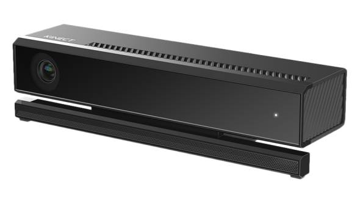
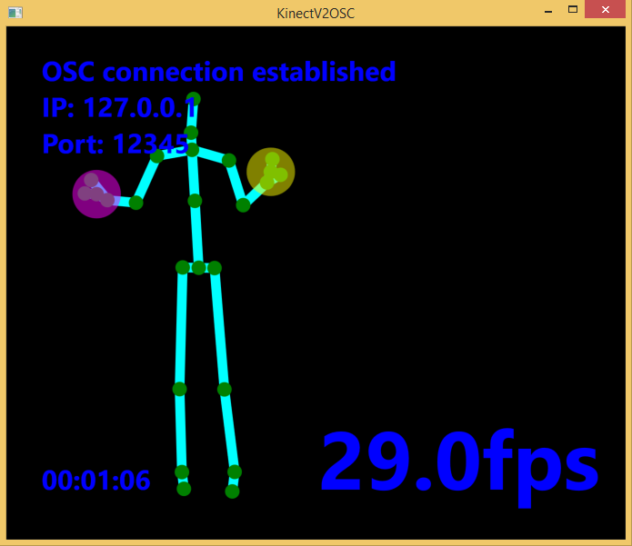
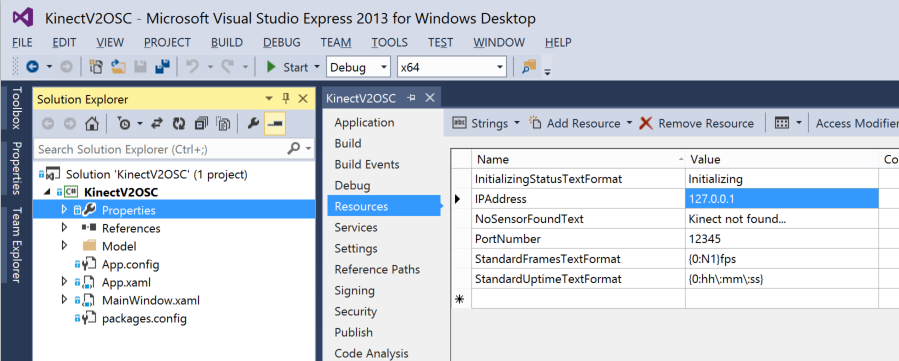

KinectV2OSC
===========
Broadcasts [KinectV2](http://www.microsoft.com/en-us/kinectforwindows/purchase/) skeletal data over OSC. That's it.



Handy if you want to quickly get skeleton data off of Windows and onto Mac, or into some other Windows app.

Instructions
------------
- Note that you need Windows 8.1, USB3, and a new V2 Kinect sensor
- Download and install the [Kinect for Windows SDK 2.0 Public Preview](http://www.microsoft.com/en-us/download/details.aspx?id=43661)
- Install Visual Studio (I am using [Visual Studio Express 2013 for Windows Desktop](http://www.visualstudio.com/en-us/products/visual-studio-express-vs.aspx) - scroll down to find the download link)
- Clone this repo, and open KinectV2OSC.sln in Visual Studio. Hit the green 'Start' button. You should see a screen like this:



- To send to another destination, change the IP and port number here, and then re-launch:



OSC
---
OSC messages are continuously sent in this format, for each joint on each skeleton:

```sh
Address: /bodies/{bodyId}/joints/{jointId}
Values: - float:  positionX
        - float:  positionY
        - float:  positionZ
        - string: trackingState (Tracked, NotTracked or Inferred)
```

Project dependencies
--------------------
- [Rug OSC](https://www.nuget.org/packages/Rug.Osc/) to format and send messages